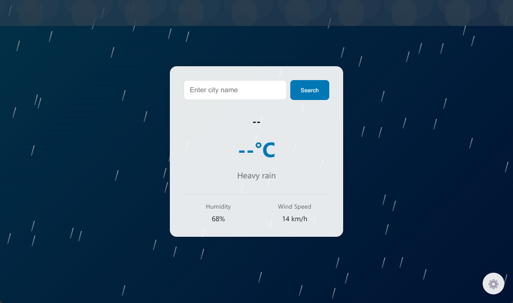

# SimpleWeatherApp 🌤️

A beautiful, interactive weather dashboard with real-time weather animations and developer controls.

## ✨ Features

- 🌍 Real-time weather data from Open-Meteo API
- 🎨 Dynamic weather animations
- 🌡️ Temperature, humidity, and wind speed tracking
- 🛠️ Developer controls for testing weather conditions
- 📱 Responsive design
- 🌈 Beautiful gradients for different weather states

## 📄 License

This project is licensed under the MIT License - see the [LICENSE](LICENSE) file for details.

## 🚀 Installation

1. Download the three files (`index.html`, `main.css`, and `app.js`)
2. Place them in the same folder
3. Open `index.html` in your web browser

That's it! No additional setup required.

## 🔧 Usage

1. Enter a city name in the search box
2. Press Enter or click the Search button
3. View real-time weather information and animations

### Developer Controls

Access the developer panel by clicking the ⚙️ icon:

- Weather Type: Clear, Cloudy, Rainy
- Cloud Coverage: Scattered, Broken, Overcast
- Rain Intensity: Light, Moderate, Heavy
- Wind Speed: 0-40 km/h
- Humidity: 0-100%

## 🌐 API Reference

This project uses the following APIs:

- [Open-Meteo Weather API](https://open-meteo.com/en/docs)
- [Open-Meteo Geocoding API](https://open-meteo.com/en/docs/geocoding-api)

## 🎨 Weather States

The app includes various weather states with corresponding animations:

- Clear: Animated sun with glow effect
- Cloudy: Dynamic cloud movements
- Rainy: Realistic rain animation with intensity levels
- Wind Effects: Direction and speed-based animations

## 📧 Contact

Portfolio - [din.works](https://din.works)

Project Link: [simple-weather-app](https://github.com/DindinYT37/simple-weather-app)